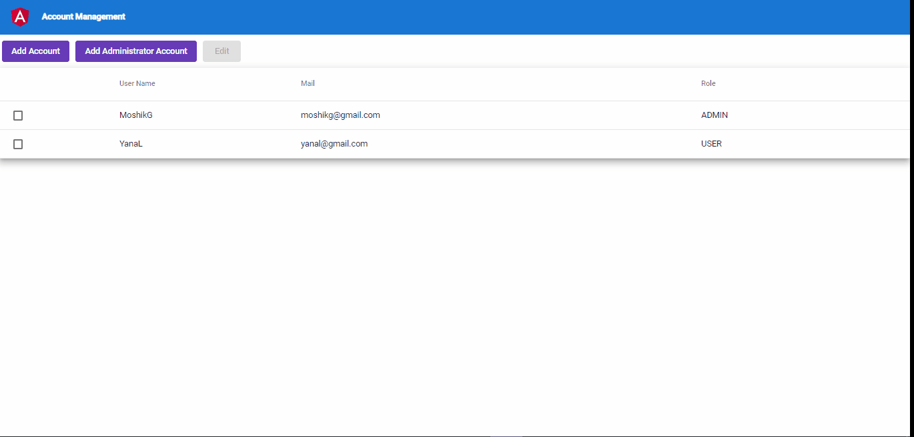
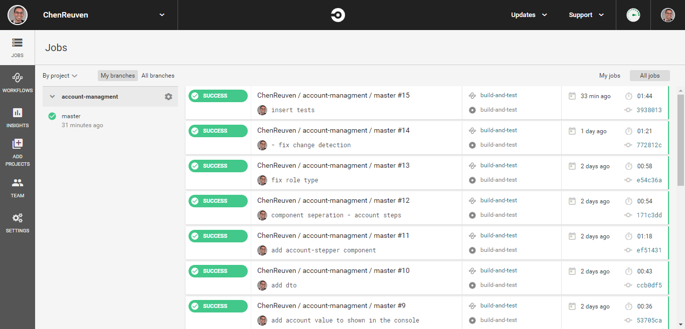
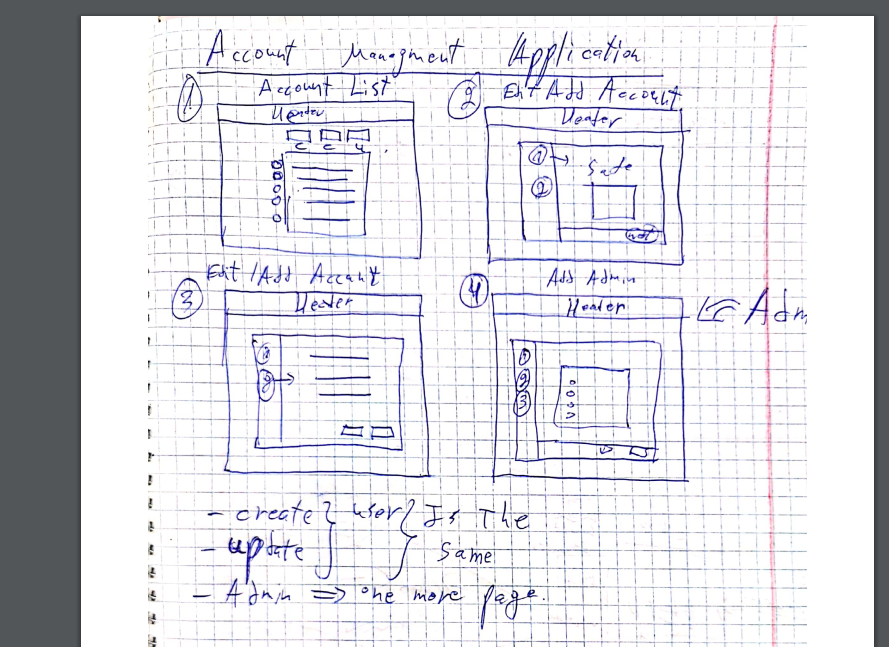
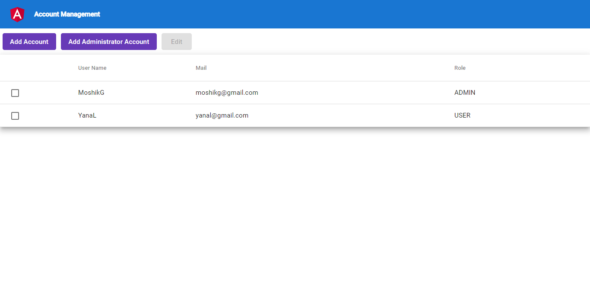
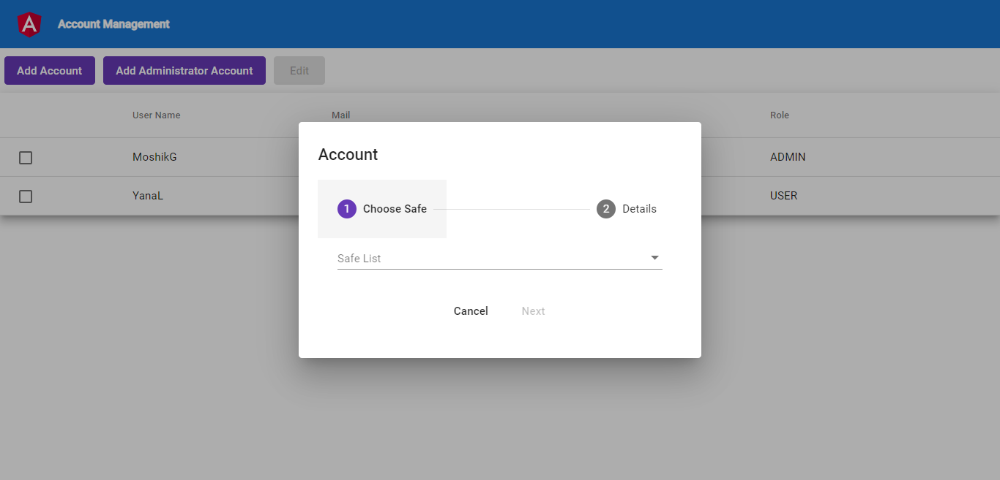
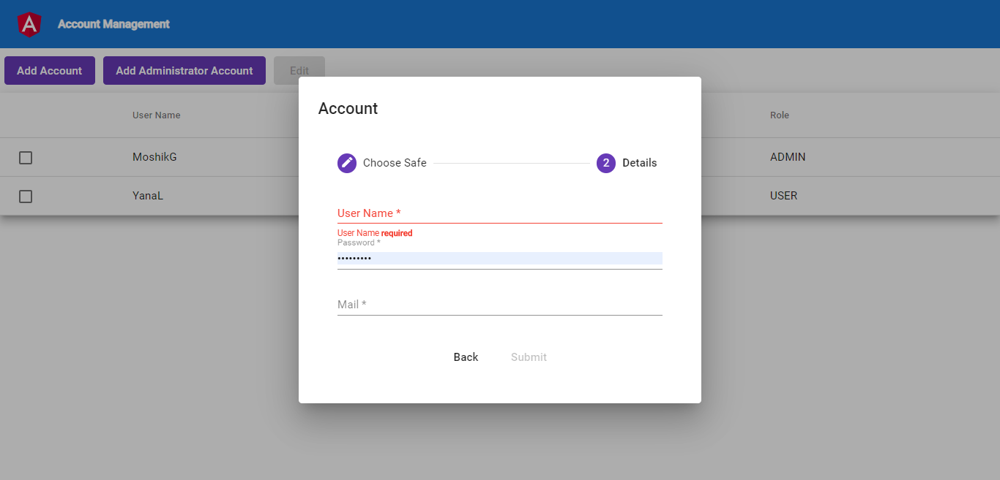
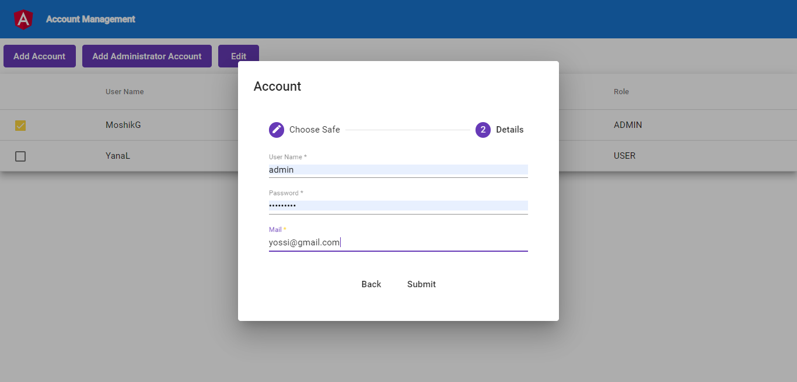
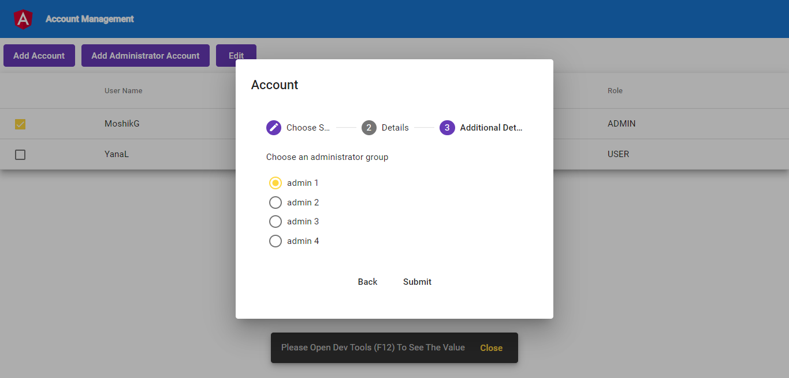

# Account Managment

## App - Show Case

#### App - CI - Circle CI
1. I add a mechanism for CI with Circle CI.
2. Per each Pus the build will run with lint, build, and test command to 
verify that the whole process is valid.

##################################################
## Requirements
1. As a user i want to see my accounts
2. As a user i want to:
- add user account
- add admin account
- edit account (user/admin)

## Use Cases
1. show all accounts
2. add account (user)
3. edit account user
4. add account (admin)
5. edit account admin

## Design And Separation
Note: 
- All the Data is syncronice (simple)
- I created tests not to every scenario in the app, but just show several capabilities and test types

##### Mocks (Screens)

##### Entities
1. Account
	- id
	- userName
	- password
	- mail
	- safeId
	- role: 'Admin' | 'User'
	- additionalInfo: {
		administratorGroupId
	}

2. Safe
	- id
	- name

## Implementation And Tests
- separated to account module with sub component
- stepper with component per step
- Test is made not per each component but for several scenarios

#### Component Separation
1. Account Module
    - account actions component
    - account list component
    - account dialog
        - account stepper
            - account safe step
            - account details fill
            - account admin groups (Only for admin)

## Tools
- angular material
- spectator (testing library)

# Project Installation

This project was generated with [Angular CLI](https://github.com/angular/angular-cli) version 9.0.3.

## Development server

Run `ng serve` for a dev server. Navigate to `http://localhost:4200/`. The app will automatically reload if you change any of the source files.

## Code scaffolding

Run `ng generate component component-name` to generate a new component. You can also use `ng generate directive|pipe|service|class|guard|interface|enum|module`.

## Build

Run `ng build` to build the project. The build artifacts will be stored in the `dist/` directory. Use the `--prod` flag for a production build.

## Running unit tests

Run `ng test` to execute the unit tests via [Karma](https://karma-runner.github.io).

## Running end-to-end tests

Run `ng e2e` to execute the end-to-end tests via [Protractor](http://www.protractortest.org/).

## Further help

To get more help on the Angular CLI use `ng help` or go check out the [Angular CLI README](https://github.com/angular/angular-cli/blob/master/README.md).

## App Images

